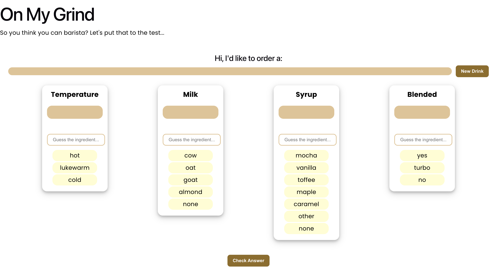
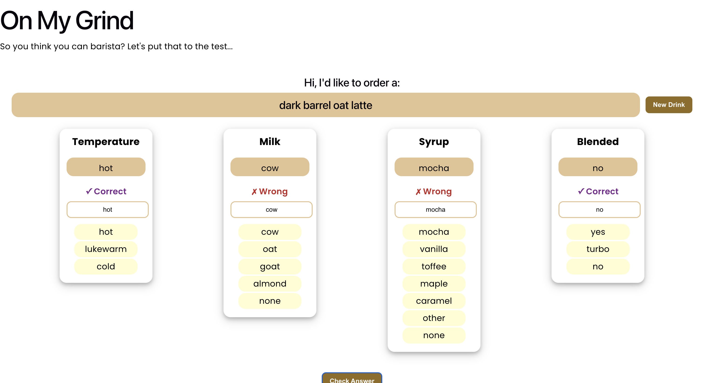
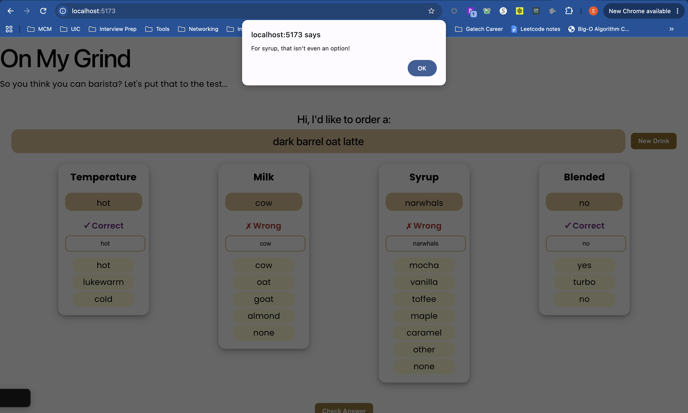

# ☕ On My Grind

A Wordle-inspired barista quiz built with React and Vite. A random (and possibly discontinued) Starbucks drink appears, and you guess its temperature, milk, syrup, and blendedness. Check your answer and the app marks each guess correct or wrong.

Built for CodePath WEB 102, Unit 3 Lab.

## Features

### Required
- One Starbucks drink shows at a time for the user to guess
- The user picks one option per category (temperature, milk, syrup, blended); each choice fills the answer box above it, replacing any earlier choice
- Clicking **Check Answer** compares the guesses to the real recipe and visually marks each answer box correct or wrong
- Clicking **New Drink** loads a fresh random drink and clears the inputs

### Stretch
- The user can type answers into a text box instead of clicking, with typed input validated against the real choices (an alert fires when the guess isn't even a valid option)

## Walkthrough

### Empty form
The quiz form before any answers are entered: the title, the drink bar with a New Drink button, and the four ingredient cards (Temperature, Milk, Syrup, Blended).



### After checking an answer
After picking guesses and clicking Check Answer, each answer box turns purple (correct) or red (wrong), with matching ✓ Correct / ✗ Wrong labels.



### Stretch: text-input version with validation
Each ingredient has a text box for typing a guess. If the typed value isn't one of the real choices, the app alerts the user.



### Demo
A full run: click New Drink, make guesses, then Check Answer to see the results.

<!-- Upload demo.mov on github.com and paste ONLY the generated user-attachments link on the blank line below (no other text) -->


## What I practiced
- Building React forms from scratch with dynamically populated choices
- Creating custom components that accept props (`RecipeChoices`)
- Creating and updating state variables of several kinds (objects and strings)
- Importing a JSON data file and using it to drive the UI
- Using state to change what appears on the page (correct/wrong feedback)

## Running locally

```bash
npm install
npm run dev
```

Then open the `http://localhost:5173/` link that Vite prints.

## Tech stack
- React
- Vite
